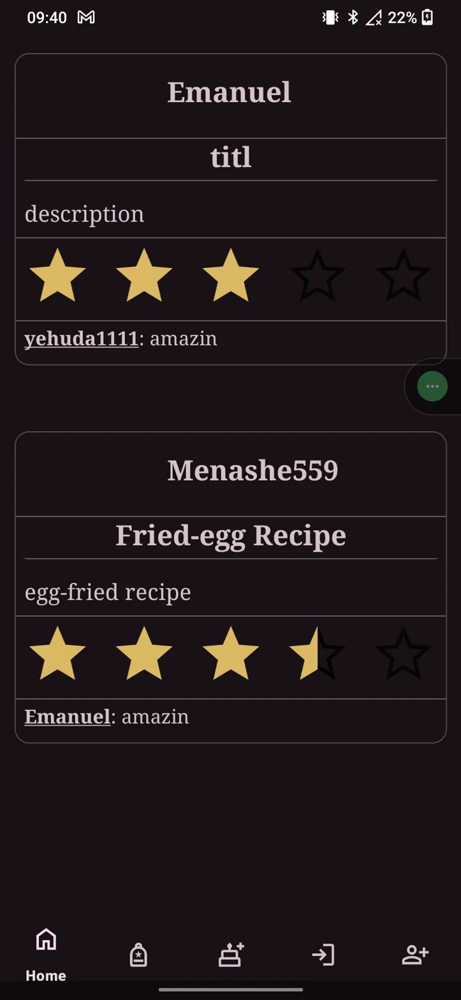
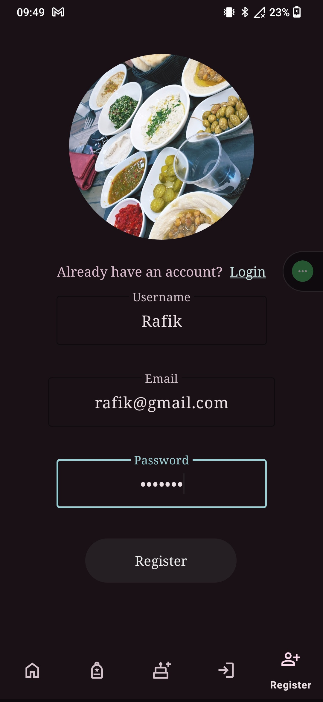
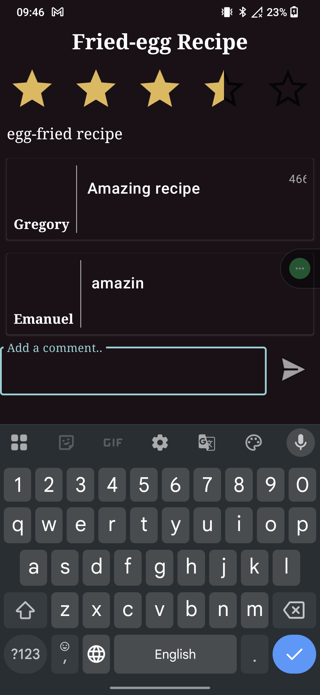

# RecipeHub

A social Android app for sharing, browsing, and rating recipes, with both online and offline support (Firebase + a local Room database).

Solo project.

<p align="center">
  
  
  
</p>

## Features

- Upload recipes with images, ingredients, and instructions
- Rate other users' recipes (1–5 stars)
- Browse recipes by popularity or newest
- Offline access to saved recipes via a local Room database
- Firebase authentication and cloud storage
- Material Design UI (cards, spinners, and standard components)

## Tech stack

| Layer | Tech |
|---|---|
| App | Kotlin (Android) |
| Backend/Cloud | Firebase (Auth, Firestore, Storage) |
| Local storage | Room (DAO) |
| Async | Kotlin Coroutines |
| UI | Material Design components |

## Running it locally

### 1. Clone the repository

```bash
git clone https://github.com/EmanuelTurko/RecipeHub.git
cd RecipeHub
```

### 2. Open in Android Studio

Open the project folder in Android Studio.

### 3. Set up Firebase

- Go to the [Firebase Console](https://console.firebase.google.com/) and create a new project
- Register your Android app using the package name from `AndroidManifest.xml`
- Download the generated `google-services.json` file
- Place it inside the `/app` directory

### 4. Build and run

Run the app on an emulator or a physical Android device from Android Studio.
